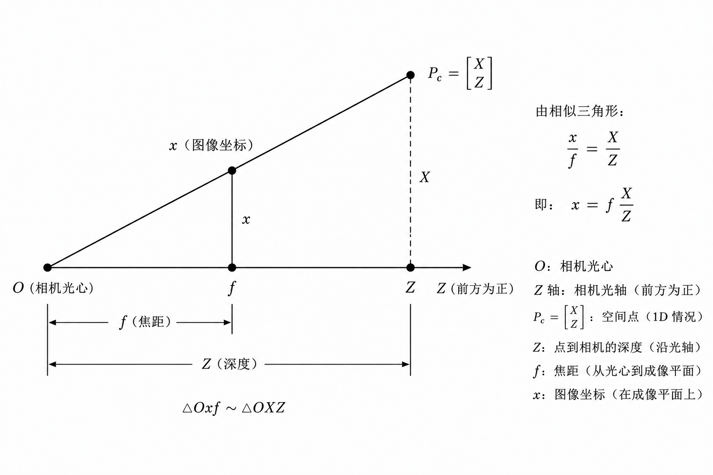

# Task 1 Theory：相机标定与 ArUco 三维渲染

## 1 相机标定

### 1.1 内参
相机图像只是二维像素。**像素点** $(u, v)$ 指的是光线落在传感器的位置，但它本身不告诉我们物体离相机有多远。也就是说如果你在近处摆一个小的东西，远处摆一个大的东西。它们在相机里是有可能重合的。

所以我们需要相机模型。最常用的基础模型是**针孔相机模型**，也就是常说的小孔成像。假设相机坐标系中有一点：

$P_c = \begin{bmatrix} X \\ Y \\ Z \end{bmatrix}$

其中 $X$ 向右，$Y$ 向下，$Z$ 向前。图像坐标为 $(u, v)$，相机焦距为 $f_x, f_y$，主点为 $(c_x, c_y)$。投影关系为：

$u = f_x \frac{X}{Z} + c_x$

$v = f_y \frac{Y}{Z} + c_y$



这两个式子是线性的，所以可以写成矩阵乘：

$s \begin{bmatrix} u \\ v \\ 1 \end{bmatrix} =
\begin{bmatrix}
f_x & 0 & c_x \\
0 & f_y & c_y \\
0 & 0 & 1
\end{bmatrix}
\begin{bmatrix} X \\ Y \\ Z \end{bmatrix}$

理想情况下，中间的矩阵就称为相机内参矩阵（Intrinsics）：

$K =
\begin{bmatrix}
f_x & 0 & c_x \\
0 & f_y & c_y \\
0 & 0 & 1
\end{bmatrix}$


### 1.2 畸变

真实镜头不是理想小孔，而是透镜，所以图像边缘常常会弯曲，这就是畸变。我们经常用多项式来模拟即便，比如OpenCV设置的畸变参数就是一个$5$维向量：

$[k_1, k_2, p_1, p_2, k_3]$

其中 $k_1, k_2, k_3$ 描述径向畸变，$p_1, p_2$ 描述切向畸变。

对于相机上的坐标 $(x, y)$，令：

$r^2 = x^2 + y^2$

由于径向畸变理解为点离图像中心越远，偏移越明显，我们用与$r$有关的多项式来模拟：

$x_{radial} = x(1 + k_1 r^2 + k_2 r^4 + k_3 r^6)$

$y_{radial} = y(1 + k_1 r^2 + k_2 r^4 + k_3 r^6)$

由于出厂的时候，镜头和传感器不完全平行，所以还会有切向畸变：

$x_{tangential} = 2p_1xy + p_2(r^2 + 2x^2)$

$y_{tangential} = p_1(r^2 + 2y^2) + 2p_2xy$

OpenCV 的 `cv2.calibrateCamera(...)` 会同时估计内参和这些畸变参数。

### 1.3 棋盘格标定

棋盘格角点的真实三维坐标是已知的。因为棋盘格是一张平面纸，为了计算方便，我们就把棋盘格所在的平面设成坐标平面，这样棋盘格上点的所有$Z$就都是$0$。

如果棋盘格每个格子的边长为 $d$，第 $r$ 行第 $c$ 列角点的三维坐标就是：

$P_{r, c} = \begin{bmatrix} c \cdot d \\ r \cdot d \\ 0 \end{bmatrix}$

每张标定图片中，OpenCV 会检测对应的二维角点：

$p_{r, c} = \begin{bmatrix} u_{r, c} \\ v_{r, c} \end{bmatrix}$

这样一张图片就提供了很多组 $3D \leftrightarrow 2D$ 对应关系。多拍几张不同角度、不同位置的棋盘格，OpenCV 就能从这些对应关系中估计相机参数。基本步骤如下：

1. 准备棋盘格图片，放入 `tasks/task1-aruco/data/calibration/`。
2. 逐张读取图片，转灰度图。
3. 用 `cv2.findChessboardCorners(...)` 找到所有的二维角点。
4. 用 `cv2.cornerSubPix(...)` 做亚像素精修。
5. 把所有图片的三维点和二维点传给 `cv2.calibrateCamera(...)`。
6. 保存 `camera_matrix` 和 `dist_coeffs` 到 `output/camera_params.json`。

`cv2.calibrateCamera(...)` 的输入可以理解为：

- `object_points`：每张图中棋盘格角点的真实三维坐标。
- `image_points`：每张图中检测到的二维像素坐标。
- `image_size`：图像宽高。

输出里最重要的是：

- `camera_matrix`：相机内参矩阵 $K$。
- `dist_coeffs`：畸变参数。
- `rvecs, tvecs`：每张标定图片的外参。
- `rms`：重投影误差，正常的重投影误差应该是0.1-0.5左右。

### 1.4 重投影误差
我们用求出的 $K$、畸变、旋转和平移，把棋盘格三维点重新投影回图像，比较投影点和真实检测点之间差多少。对第 $i$ 个点：

$e_i = \left\| p_i - \hat{p_i} \right\|_2$

然后对所有$c_i$计算MSE或者RMS，所有点的平均误差越小，说明标定参数越能解释你的图片。

### 1.5 选读：张正友标定法
如果要阅读下面的内容，你首先要理解**齐次坐标**（Homogeneous coordinates）和**单应矩阵**（Homography matrix）是什么，都非常好懂的。如果你还不了解或不太清楚它的基本操作，可以查看Szeliski的经典著作 *Computer Vision: Algorithms and Applications* 的第一章。

#### DLT （discrete linear transform）求内参

棋盘格在自身坐标系中是平面，所以点可以写成 $(X, Y, 1)$。图像点写成齐次形式 $(u, v, 1)$。对于某一张图片，二者满足单应性：

$s \begin{bmatrix} u \\ v \\ 1 \end{bmatrix}
= H \begin{bmatrix} X \\ Y \\ 1 \end{bmatrix}$

这里 $H$ 是 $3 \times 3$ 矩阵。它描述"棋盘格平面上的点"如何映射到"图像平面上的点"。把它展开可以得到两个方程。我们换一个视角，由于这里$u,v,X,Y$是已知的，$H$是未知的，我们把 $H$ 的 9 个元素展平成9维向量 $h$。由于每一组对应点可以提供两个方程，所以说$n$个点就可以组成一个$2n \times 9$的矩阵$A$，并构造方程

$A h = 0$

这个线性方程，我们用 SVD 求 $A$ 最小奇异值对应的右奇异向量，就是$h$的**最小二乘解** 。把这个向量 reshape 成 $3 \times 3$，并用$H_{33}$归一化，就得到当前图片的 $H$ （为什么要归一化，因为是Homogeneous coordinates）。


理想情况下，单应性可以分解为内参和外参的复合：

$\begin{bmatrix}h_1 & h_2 & h_3\end{bmatrix} = K \begin{bmatrix} r_1 & r_2 & t \end{bmatrix}$

其中 $r_1$ 和 $r_2$ 是旋转矩阵的前两列。由于旋转矩阵是单位正交矩阵的某个倍数，所以有：

$r_1^T r_2 = 0$， $r_1^T r_1 = r_2^T r_2$

令 $B = (KK^T)^{-1}$， 我们对上述两个式子同乘同除$K$，也就是：

$r_1^T K^T (K^{-T} K^{-1}) K r_2 = 0$
$r_1^T K^T (K^{-T} K^{-1}) K r_1 = r_2^T K^T (K^{-T} K^{-1}) K r_2$

也就是
$h_1^T B h_2 = 0$
$h_1^T B h_1 = h_2^T B h_2$

每张图都可以提供上面的两个方程，我们同样用DLT方法，将$B$展平成向量$b$，所有的方程构造一个的矩阵$V$，满足 $Vb = 0$，再用同样的方法求它的最小二乘解。

得到 $B$ 后，可以从它恢复 $f_x, f_y, c_x, c_y$ 和 skew。常见推导会把：

$B =
\begin{bmatrix}
B_{11} & B_{12} & B_{13} \\
B_{12} & B_{22} & B_{23} \\
B_{13} & B_{23} & B_{33}
\end{bmatrix}$

代入 $B = K^{-T}K^{-1}$，再按元素解出内参。这个方程是有闭式解的，你可以查询相关的推导过程。但是由于现实中噪声很大，OpenCV 的实现并不直接用这个闭式解，而是继续用非线性优化最小化重投影误差的方式求解内参和畸变参数。

#### 恢复每张图的外参

对每张图片的 $H$，有：

$\lambda r_1 = K^{-1}h_1$

$\lambda r_2 = K^{-1}h_2$

$\lambda t = K^{-1}h_3$

然后，由叉乘的性质， $r_3 = r_1 \times r_2$

由于噪声存在，拼出的 $R = [r_1, r_2, r_3]$ 可能不完全是正交矩阵。可以对 $R$ 做 SVD，把它投影回最近的合法旋转矩阵。

#### 估计畸变

上面的线性步骤先忽略畸变。得到初始 $K, R, t$ 后，可以根据重投影残差估计畸变参数，再使用非线性优化最小化所有点的总重投影误差：

$\min_{K, d, R_i, t_i} \sum_i \sum_j \left\| p_{ij} - \pi(K, d, R_i, t_i, P_j) \right\|^2$

其中 $\pi(...)$ 表示带畸变的投影函数。

## 2 旋转向量与旋转矩阵
我们知道，三维的旋转向量有3个自由度，可以用一个三位向量表示:

$r = k \theta$

其中 $k$ 是旋转轴的单位向量，$\theta$ 是旋转角度。而旋转矩阵是一个 $3 \times 3$ 的矩阵，有9个元素，但它只有3个自由度，它们之间有指数关系：
$R = e^{[r]_\times}$
其中 $[\cdot]_\times$ 是反对称矩阵：
$[x]_\times =
\begin{bmatrix}0 & -x_z & x_y \\
x_z & 0 & -x_x \\
-x_y & x_x & 0\end{bmatrix}$    

由泰勒展开和反对称矩阵的幂周期性，我们有Rodrigues公式：

$R = I + \sin \theta [k]_\times + (1 - \cos \theta) [k]_\times^2$

具体推导可以查看任何一本高代教材（比如杨一龙的讲义（大雾）），这里就不赘述了。Szeliski的书里有一个比较简单的的推导，在第2版41页起，可以看一看。不过幸好`OpenCV`里有`cv2.Rodrigues(...)` 这个函数可以直接帮我们在旋转向量和旋转矩阵之间转换，之后也会用到。

## 3 ArUco Marker的位姿估计

相机标定完成后，就可以估计 ArUco marker 的位姿。已知 marker 是一个边长为 $L$ 的正方形。我们把 marker 中心作为局部坐标原点，四个角点为：

$P_1 = \begin{bmatrix} -L/2 \\ L/2 \\ 0 \end{bmatrix}$

$P_2 = \begin{bmatrix} L/2 \\ L/2 \\ 0 \end{bmatrix}$

$P_3 = \begin{bmatrix} L/2 \\ -L/2 \\ 0 \end{bmatrix}$

$P_4 = \begin{bmatrix} -L/2 \\ -L/2 \\ 0 \end{bmatrix}$

OpenCV 的 ArUco 检测会给出图像中的四个角点。PnP （Perspective-n-Point）解算的作用就是通过已知点和相机内参矩阵得到相机的外参，也就是旋转 $R$ 和平移 $t$，让每个三维角点投影后尽量靠近对应二维角点：

$\begin{bmatrix} u_i \\ v_i \\ 1 \end{bmatrix}
\sim K(RP_i + t)$

PnP算法较为复杂，这里不做赘述，你只需要知道`cv2.solvePnP(...)` 可以输出 `rvec` 旋转向量，和`tvec` 平移向量。PnP有不同的参数，并且有多解，这里如果不填参数，默认选取了最优解，如果有兴趣可以查阅OpenCV文档。这里，`rvec`可以通过 `cv`里的`Rodrigues` 公式转换成旋转矩阵。

## 4 OBJ文件的渲染

OBJ 文件里保存的是模型自己的三维顶点，例如：

```text
v 0 0 0
v 1 0 0
v 0 1 0
f 1/1/1 2/2/2 3/3/3
```

`v` 表示顶点，`f` 表示面。代码会把 OBJ 顶点读出来，缩放到和 marker 大小相近，再用 `cv2.projectPoints(...)` 投影到图像上。

投影关系仍然是：

$\begin{bmatrix} u \\ v \\ 1 \end{bmatrix}
\sim K(RP + t)$

这里的 $R, t$ 来自 ArUco marker 的 pose。只要 marker pose 稳定，模型就会跟着 marker 稳定移动。

## 常见问题

- 标定的时候一定注意标定板的尺寸是**内角点**的数量，而不是格子的数量。比如说一个 $7 \times 7$ 的棋盘格，内角点的数量是 $6 \times 6$。
- 如果你用手机进行标定，要注意手机可能会自动对焦，自动调光圈，自动调分辨率等等，这些参数，由我们上述的数学推导，都是**不可变**的，如果你渲染出的东西变成了super面筋人大概率是这个问题。如果你不太清楚手机的相机参数是否会变，可以**联系我们用工业相机和实验室的大标定板进行本次作业**。

## References

- [Computer Vision: Algorithms and Applications](https://eclass.hmu.gr/modules/document/file.php/TM152/Books/Computer%20Vision%3A%20Algorithms%20and%20Applications%20-%20Szeliski.pdf) 
- [OpenCV Camera Calibration](https://docs.opencv.org/4.x/dc/dbb/tutorial_py_calibration.html)
- [OpenCV ArUco marker 官方教程](https://docs.opencv.org/4.x/d5/dae/tutorial_aruco_detection.html)
- [张正友标定法](https://www.microsoft.com/en-us/research/wp-content/uploads/2016/02/tr98-71.pdf)
- [OpenCV `solvePnP`](https://docs.opencv.org/4.x/d5/d1f/calib3d_solvePnP.html)
